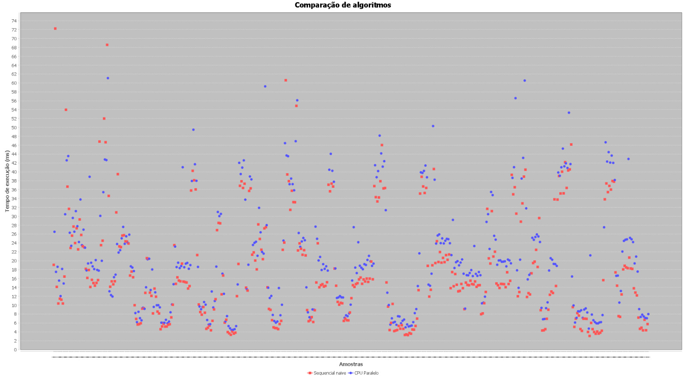

# Comparação de Algoritmos de Busca

### Professor:
- Izequiel Noroes

### Alunos:
- Pedro Souto (2320443)
- Matheus Gadelha (2210469).

## Resumo
Este projeto teve como objetivo analisar o 
desempenho de algoritmos de busca em diferentes 
cenários, utilizando Java. A análise 
inclui a implementação de algoritmos, 
registro de tempos de execução e 
comparação em termos de eficiência sob 
diferentes condições.

---

## Introdução
A busca eficiente em grandes volumes de dados é 
um problema essencial na computação. 
Este trabalho explora o desempenho dos 
algoritmos de busca sequenciais e paralelos 
utilizando processamento em CPU.
O estudo busca identificar padrões de desempenho e 
apresentar conclusões sobre a eficiência dos métodos,
considerando variações de tamanho de conjunto de 
dados e ambientes de execução.

---

## Metodologia

Análise estatística dos resultados obtidos para identificar padrões de desempenho e comparar os algoritmos sob diferentes condições.

---

## Resultados e Discussão
Os testes realizados apresentaram os seguintes resultados:

- **Gráficos de Desempenho**  
  Abaixo estão gráficos que ilustram os tempos de execução dos algoritmos sequenciais e paralelos:

    


- **Observações**
    - A busca paralela apresentou ganhos significativos em grandes conjuntos de dados.
    - O overhead de inicialização tornou a busca sequencial mais eficiente em cenários pequenos.

---

## Conclusão
Este estudo mostrou resultados melhores 
no algoritmo paralelo em cenários que 
possuem um grandes conjuntos de dados, 
enquanto o algoritmo sequencial foi melhor 
em buscas menores devido ao menor overhead. 
Os resultados mostram como é importante escolher 
o algoritmo certo dependendo do tamanho dos 
dados e do ambiente onde ele vai rodar.


---

## Referências
1. **Livros Utilizados**
    - Don Quixote
    - Moby Dick
    - Dracula

2. **Ferramentas e Tecnologias**
    - Java
    - JOCL
    - Apache Maven

---

## Anexos
### Códigos das Implementações
Os códigos fonte das implementações estão disponíveis no repositório GitHub do projeto:

[https://github.com/pedrosoutinho/book-parallel-search/tree/master](https://github.com/pedrosoutinho/book-parallel-search/tree/master)

**Estrutura do código:**
- `NaiveSerialSearch.java`: Implementação da busca sequencial.
- `ParallelCPUSearch.java`: Implementação da busca paralela.
- `Main.java`: Classe principal para execução e coleta de resultados.
- `resultados.csv`: Arquivo com os tempos de execução registrados.

Pra rodar:
```
mvn compile
mvn exec:java -Dexec.mainClass="Main"
```


